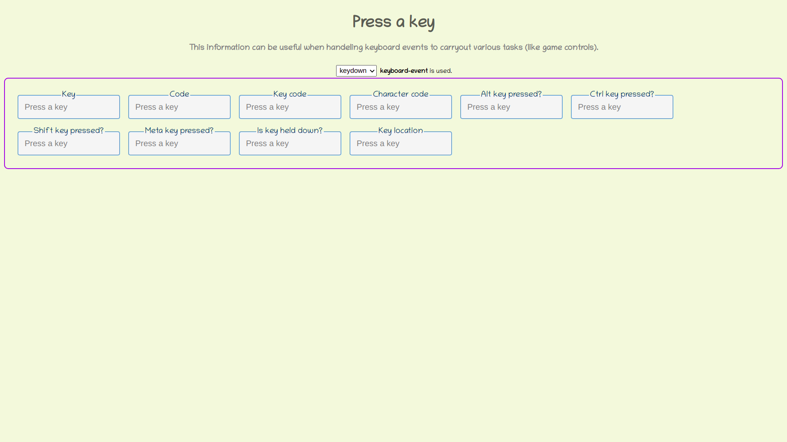

# DOM Key Check
You can see different useful properties of keyboard-events, interactively, for different keys of the keyboard in the DOM or web-page.

## Keyboard events used
1. **keydown:** Fired for all keys when pressed down, regardless of whether they produce a character value. [Full doc](https://developer.mozilla.org/en-US/docs/Web/API/Document/keydown_event)
2. **keypress:** Fired when a key that produces a character value is pressed down. [Full doc](https://developer.mozilla.org/en-US/docs/Web/API/Document/keypress_event)
3. **keyup:** Fired for all keys when released, regardless of whether they produce a character value. [Full doc](https://developer.mozilla.org/en-US/docs/Web/API/Document/keyup_event)

## How to use?
1. When the page loads make sure the focus is within the body of the document.
2. Choose the type of keyboard-event you want, either `keydown` or `keypress`. The `keyup` event is not in the options because it will be fired for both `keydown` and `keypress` when the key is released.
3. Press any key.
